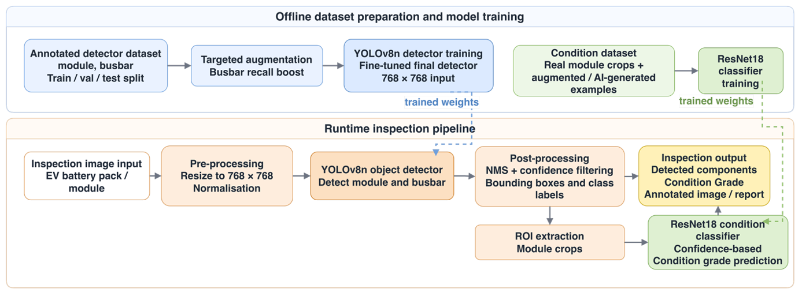
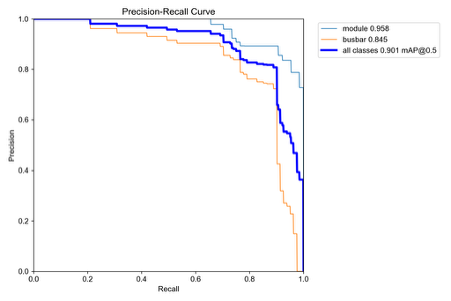
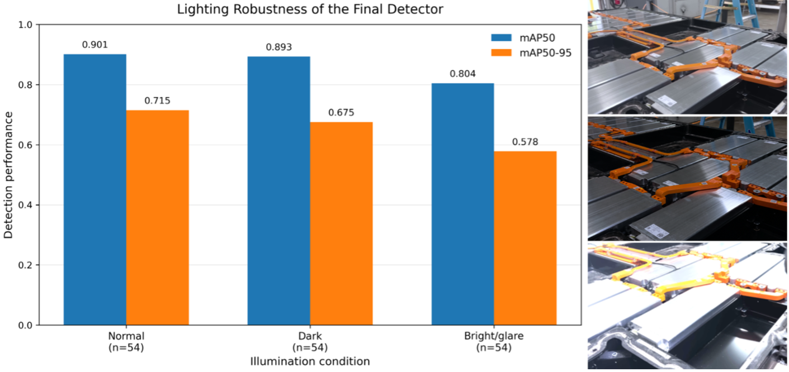
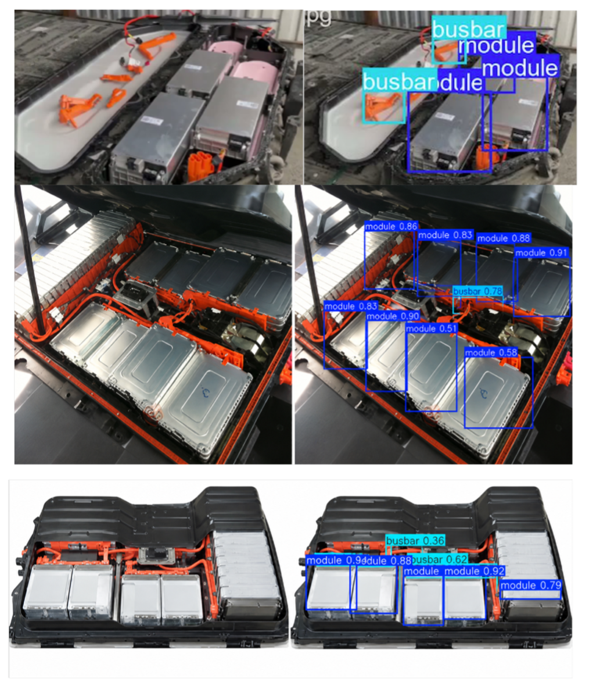
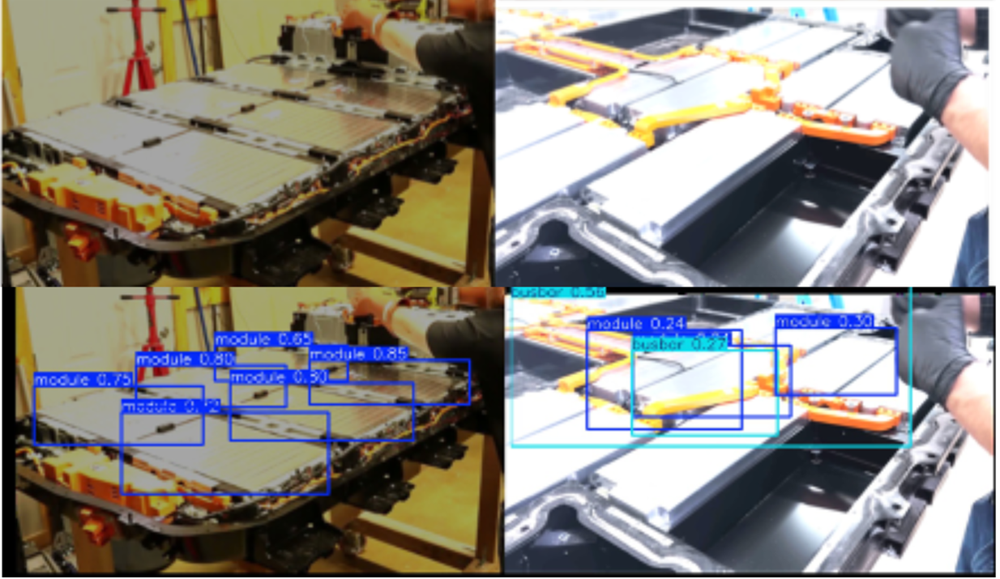
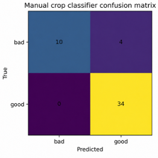

# Vision-Based Detection and Condition Assessment of EV Battery Components

This repository contains the implementation files for a final-year engineering project on **EV battery component detection and condition assessment for circular manufacturing**.

The project uses a CPU-deployable two-stage computer vision pipeline:

```text
Input image / video
        ↓
YOLOv8n detector
        ↓
Detected module / busbar regions
        ↓
Crop detected module regions
        ↓
ResNet18 binary condition classifier
        ↓
Condition triage output and annotated image
```

The repository is intended as a clean academic research implementation rather than a production-ready industrial deployment.

---

## Project Summary

Current EV battery disassembly relies heavily on manual inspection. This project explores whether a lightweight computer vision pipeline can localise valuable EV battery components and provide feasibility-level condition assessment on CPU hardware.

The final report presents:

- YOLOv8n object detection for battery modules and busbars
- ResNet18 binary classification of module crop condition
- CPU-only deployment testing on Apple M1 hardware
- lighting robustness analysis
- iterative detector training and busbar-targeted recall augmentation
- integrated detection and classification inference

---

## Reported Final Results

| System Element | Reported Result |
|---|---:|
| Detector | YOLOv8n |
| Detection classes | `module`, `busbar` |
| Detector mAP50 | 0.901 |
| Detector mAP50-95 | 0.715 |
| Detector latency | 78.9 ms/frame |
| Detector FPS | 12.7 FPS |
| Hardware | Apple M1 CPU, no GPU acceleration |
| Classifier | ResNet18 |
| Classifier task | `bad` vs `good` module crop classification |
| Classifier accuracy | 91.7% |
| Classifier weighted F1 | 0.912 |

Grade A/B/C output is treated as **confidence-thresholded triage**, not as a validated three-class engineering grading model.

---

## Representative Results

The `results/figures/` folder contains exported figures from the final report.

| Pipeline architecture | Final detector PR curve | Lighting robustness |
|---|---|---|
|  |  |  |

| Detector outputs | Two-stage pipeline outputs | Classifier confusion matrix |
|---|---|---|
|  |  |  |

---

## Repository Structure

```text
fyp-ev-vision/
│
├── README.md
├── requirements.txt
├── .gitignore
├── LICENSE
│
├── detection/
│   ├── train_detector.py
│   ├── evaluate_detector.py
│   ├── inference_detector.py
│   └── configs/
│       └── dataset.yaml
│
├── classifier/
│   ├── train_classifier.py
│   ├── evaluate_classifier.py
│   └── classify_crop.py
│
├── pipeline/
│   ├── integrated_pipeline.py
│   └── webcam_demo.py
│
├── utils/
│   ├── metrics.py
│   ├── visualisation.py
│   └── preprocessing.py
│
├── data/
│   └── sample_images/
│
├── results/
│   ├── figures/
│   ├── sample_outputs/
│   └── metrics/
│
└── docs/
    └── final_report.pdf
```

---

## Installation

Create a virtual environment and install dependencies:

```bash
python -m venv .venv
source .venv/bin/activate  # macOS/Linux
pip install -r requirements.txt
```

For Apple Silicon, PyTorch should normally be installed using the official PyTorch instructions if the standard install does not work cleanly.

---

## Dataset Format

The full datasets are not included. Add local training data using the following formats.

### Detector Dataset

```text
data/detector/
├── images/
│   ├── train/
│   ├── val/
│   └── test/
└── labels/
    ├── train/
    ├── val/
    └── test/
```

Class IDs:

```text
0 module
1 busbar
```

Update `detection/configs/dataset.yaml` to point to the dataset location on your machine.

### Classifier Dataset

```text
data/classifier/
├── train/
│   ├── bad/
│   └── good/
├── val/
│   ├── bad/
│   └── good/
└── test/
    ├── bad/
    └── good/
```

Expected class order:

```python
['bad', 'good']
```

---

## Training the Detector

```bash
python detection/train_detector.py \
  --data detection/configs/dataset.yaml \
  --weights yolov8n.pt \
  --epochs 100 \
  --imgsz 768 \
  --batch 8 \
  --name modules_busbar_yolov8n
```

For the recall-boost fine-tuning stage:

```bash
python detection/train_detector.py \
  --data detection/configs/dataset.yaml \
  --weights path/to/best.pt \
  --epochs 30 \
  --imgsz 768 \
  --batch 8 \
  --name modules_busbar_recall_boost
```

---

## Evaluating the Detector

```bash
python detection/evaluate_detector.py \
  --weights path/to/best.pt \
  --data detection/configs/dataset.yaml \
  --split test
```

---

## Training the Classifier

```bash
python classifier/train_classifier.py \
  --data data/classifier \
  --epochs 10 \
  --batch 16 \
  --lr 0.001 \
  --out path/to/best_resnet18.pt
```

---

## Evaluating the Classifier

```bash
python classifier/evaluate_classifier.py \
  --data data/classifier \
  --weights path/to/best_resnet18.pt \
  --split test
```

---

## Running the Integrated Pipeline

```bash
python pipeline/integrated_pipeline.py \
  --image path/to/test_image.jpg \
  --detector path/to/best.pt \
  --classifier path/to/best_resnet18.pt \
  --out results/sample_outputs/integrated_output.jpg
```

Output labels follow the format:

```text
module | Grade A | likely reusable | d=0.82 | p_bad=0.08
```

The confidence-thresholded triage logic is:

| Bad-class probability | Triage output | Interpretation |
|---:|---|---|
| `< 0.30` | Grade A | likely reusable |
| `0.30–0.70` | Grade B | manual review |
| `> 0.70` | Grade C | likely damaged |

---

## Webcam Demo

```bash
python pipeline/webcam_demo.py \
  --detector path/to/best.pt \
  --classifier path/to/best_resnet18.pt
```

Press `q` to quit.

On macOS, Terminal or your IDE may need camera permissions enabled in System Settings.

---

## Results and Figures

The `results/` folder contains exported figures and representative outputs from the final report. These are included so the repository can be inspected without retraining the full system.

Example folders:

```text
results/figures/
results/sample_outputs/
results/metrics/
```

---

## Limitations

This repository should be read alongside the final report. Main limitations include:

- the full dataset is not included in this repository;
- model weights are not included unless manually added locally;
- condition classification is feasibility-level only;
- Grade A/B/C is a thresholded triage interpretation, not a certified grading model;
- RealSense camera integration was attempted but not completed;
- deployment requires further validation on real condition-labelled images from multiple battery pack variants.

---

## Model Weights

Model weights are intentionally not included in this clean GitHub version. To run inference locally, place the relevant detector and classifier checkpoints somewhere on your machine and pass their paths through the command-line arguments shown above.

Suggested local final weights from the project machine were:

```text
Detector:   runs/overnight_busbar_recall_boost_768_fix/weights/best.pt
Classifier: runs/classifier/best_resnet18_manual_crop_retrained.pt
```

---

## Final Report

The assessed final report is included at:

```text
docs/final_report.pdf
```
